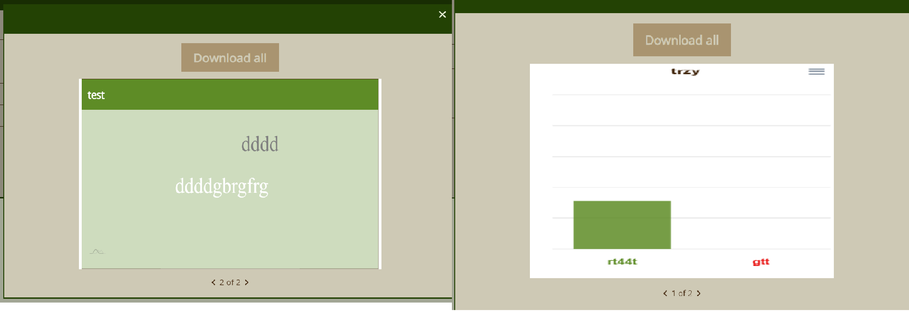

# mindsync

This repository contains a full-stack web application developed using Angular for the frontend and Spring Boot for the backend. The frontent part is organized within an Nx workspace for efficient development and further scalability.

## Table of Contents

- [Prerequisites](#prerequisites)
- [Getting Started](#getting-started)
  - [Database (Docker)](#database-docker)
  - [Backend (Spring Boot)](#backend-spring-boot)
  - [Frontend (Angular)](#frontend-angular)
- [Interfaces Examples](#interfaces-examples)

## Prerequisites

Before getting started, make sure you have the following software installed on your system:

- Node.js and npm for Angular development.
- Java Development Kit (JDK) and Maven for Spring Boot.
- Docker for running the database container.

## Getting Started

Follow these steps to set up and run the application locally.

### Database (Docker)

Make sure to have Docker installed on your system. You can set up and run the database container with the following commands:

```bash
docker run -d --name mindsync-db -e POSTGRES_PASSWORD=password -p 5432:5432 postgres:latest
```

### Backend (Spring Boot)

1. Navigate to the `backend/mindsync` directory:

   ```bash
   cd backend/mindsync
   ```

2. Run application:

   ```bash
   mvn spring-boot:run
   ```

### Frontend (Angular)

1. Navigate to the `frontend` directory:

   ```bash
   cd frontend
   ```

2. Install frontend dependencies:

   ```bash
   npm install
   ```

3. Run the Angular servers for both apps:

   ```bash
   npx nx run mindsync:serve
   ```

   The main frontend app - MindSync will be available at `http://localhost:4200/`

   ```bash
   npx nx run user-sync:serve
   ```

   The second frontend app for quizzes' prticipants will be available at `http://localhost:4300/`

## Interfaces Examples

- Home panel:
  

- Sign In and Registration Popups - after registration user receives confiramation e-mail:
  
  

- Join in Presnetation - User who has "Joining code" and want to take part in the quiz can Join it via Popup in MindSync home page. He will beredirected to UserSync available at `http://localhost:4300/`:
  

- Dashboard for authenticated users - depending user is Admin or not, navigation will contains "Admin panel" button or not. Tabs from "Quizzes" dropdown:

  - "My quizzes" navigates to Dashboard carousel.
  - "Create new" opens popup.
    
    

- Edit profile tab:
  

- Admin panel - to be modified, new functionalities to be add:
  

- Options for each quiz:

  - "Details" button navigates to page where Presenation's owner can show individual slides, modify them (change background color, title, possible answer options, type of slide, title, display time), add new slide to the quiz, delete indicated slide or whole quiz.
    
    
    

  - "Shows" button navigates to page where Quiz's owner can show details about previous shows of indicated quiz. Actions buttons enable:

    - Get preview of attendees answers screenshots, which are being captured live-time during inidcated show of the quiz. User can Download all screenshots in zipped format - design to be updated
    - Download excel file with summary for fiven show. The excel file consists of three tabs: "Symmary", "Attendee Information", "Sldie Statistics". Simple content of "Slide Statistics" available below.
    - Delete show.
      
      
      
      

  - "Start Show" button starts new show display. It uses WebSocket to communicate with UserSync app and once new user joined indicated quiz (with a given joining code), list of attendees is being updated.
    When quiz's owner wants to, he can start quiz by pressing the button. Slides will be displayed for the seconds declared in settings (in the "Details" tab). Time is live-timely counted down.
    
    

  When time go off, correct answer will be ticked in the Quiz owner's screen. For WORD_CLOUD type slides, word cloud with attendees answers will be displayed then. Quiz owner can preview Statistics of just displayed slide. The same statistics are saved as screenshots and can be later seen in "Shows" tab. Presnetation Owner can navigate via slides with "Next slide" button and once all sldies passes, finish it with "Finish" button.
  
  
  

  ### Attendee's interface for answering (UserSync):

  

  - Checkboxes are enabled and user can mark correct answer on his own screen.
    
